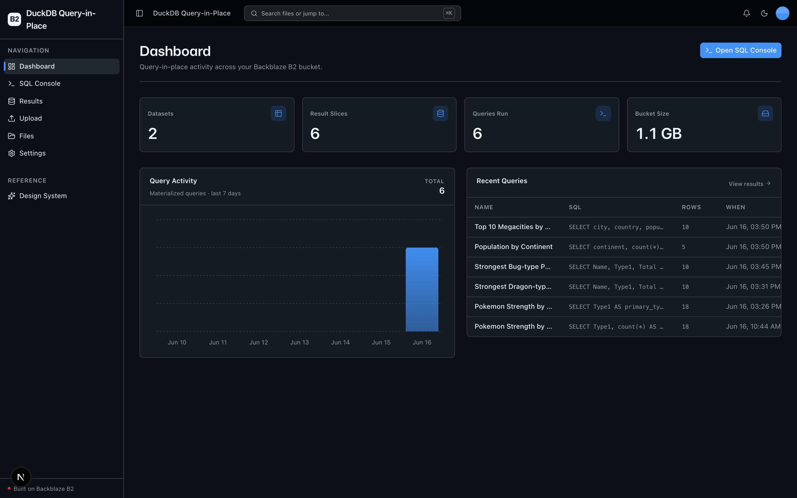
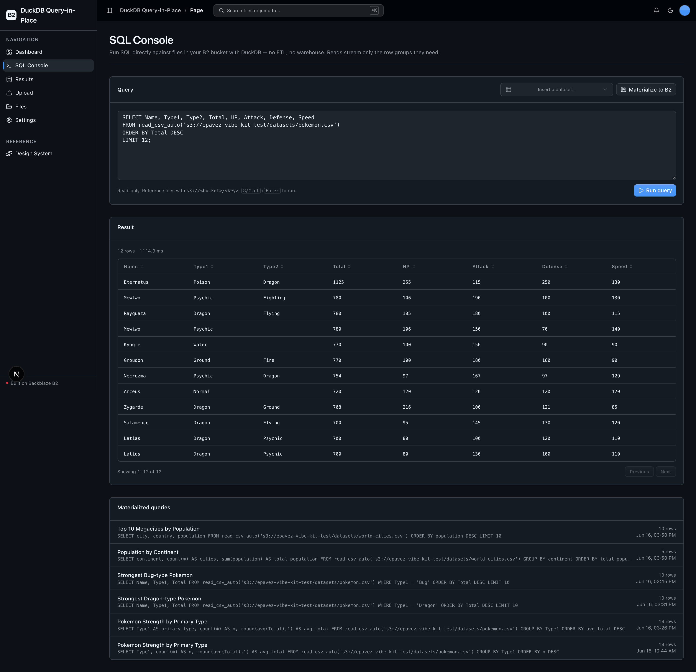
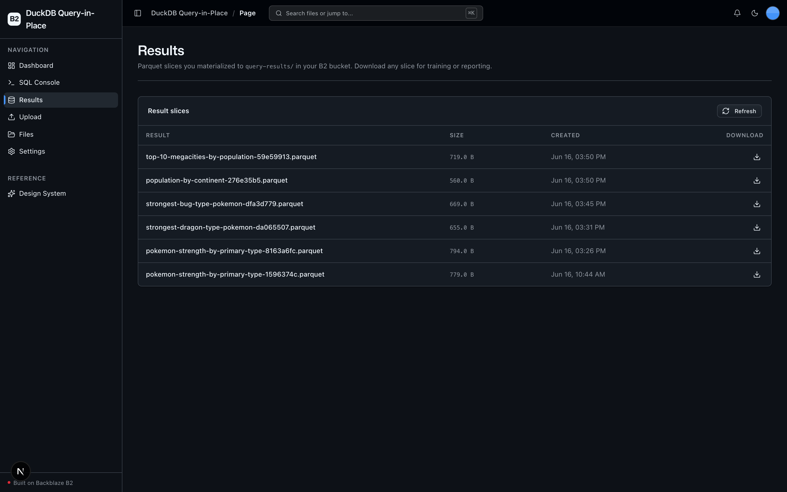

<!-- last_verified: 2026-06-16 -->
# DuckDB Query-in-Place on Backblaze B2

Run SQL directly against the logs, exports, and raw datasets already sitting in your **[Backblaze B2](https://www.backblaze.com/sign-up/ai-cloud-storage?utm_source=github&utm_medium=referral&utm_campaign=ai_artifacts&utm_content=b2ai-duckdb-query-in-place)** bucket — **no ETL, no warehouse spin-up.** This app embeds **DuckDB** with the `httpfs` extension pointed at B2's S3-compatible endpoint. Write SQL in a browser console; DuckDB streams only the Parquet/CSV/JSON row groups it needs straight from the bucket, returns a result preview, and can **materialize** the result back to B2 as a Parquet slice (`COPY ... TO 's3://...'`) ready for training or reporting.

It's a working demonstration of B2 as a **query-in-place analytics lake with continuous read/write traffic** — not cold storage. Runs entirely on local open-source tooling: **your B2 credentials are the only secret. No second API key, $0 to run a full demo.**

**What you get:**
- A SQL console that queries files in B2 in place via DuckDB `httpfs`
- Materialize results back to B2 as Parquet slices
- A Results Library scoped to your materialized slices, each downloadable
- Dataset upload (CSV / JSON / log / Parquet) + a full-bucket file explorer
- A query-activity dashboard and durable query history
- FastAPI backend with strict layered architecture and structural tests
- Agent-optimized docs — point your coding agent at the repo and start building

## What it looks like

**Dashboard** — query-in-place stats (datasets, result slices, queries run, bucket size), a 7-day query-activity chart, and a recent-queries table.



**SQL Console** — write SQL against B2 files via DuckDB, run it for a live result preview, and materialize the result back to the bucket.



**Results Library** — every materialized Parquet slice under `query-results/`, each with a presigned download.



## How query-in-place works

```
Browser SQL  ──►  FastAPI /query/run  ──►  service (guards)  ──►  repo/duckdb_client.py
                                                                        │  httpfs (S3 API)
                                                                        ▼
                                                              Backblaze B2 bucket
                                                          (ranged GETs of row groups)

Materialize  ──►  /query/materialize  ──►  COPY (...) TO 's3://bucket/query-results/<slug>.parquet'
```

DuckDB never downloads whole files: with Parquet it issues ranged `GET`s for only the row groups a query touches, all over B2's S3-compatible API.

## Agent-First Architecture

This repo is optimized for coding agents. **[AGENTS.md](AGENTS.md) is the single source of truth.** Architecture is enforced mechanically — layering rules, import boundaries, SDK/engine containment, and file-size limits are verified by structural tests and lints on every change.

```
AGENTS.md              Single source of truth — layout, invariants, commands
ARCHITECTURE.md        System layout, layering rules, query data flow
docs/
  features/            Feature docs (sql-console, materialize, results, upload, browser, dashboard)
  app-workflows.md     User journeys
  dev-workflows.md     Engineering workflows and testing
  SECURITY.md          Security principles (incl. the arbitrary-SQL trust model)
  RELIABILITY.md       Reliability expectations
  exec-plans/          Execution plans and tech debt tracker
```

### Key design decisions

| Principle | Implementation |
|-----------|---------------|
| Single source of truth for agents | AGENTS.md — layout, invariants, commands, conventions |
| Enforce invariants mechanically | Structural tests + ruff + ESLint verify boundaries |
| Strict layered architecture | `types -> config -> repo -> service -> runtime`, enforced by tests |
| Contain external engines | `boto3` **and** `duckdb` only in `repo/` — verified by structural test for boto3 |
| Keep files agent-sized | 300-line limit per file, enforced by test |
| Sandbox arbitrary SQL | local filesystem disabled + config locked in the DuckDB engine |
| Docs updated with code | Same-PR requirement prevents documentation rot |

## Quick Start

You need: Node.js >= 20, pnpm >= 9, Python >= 3.11, and a free **[Backblaze B2 account](https://www.backblaze.com/sign-up/ai-cloud-storage?utm_source=github&utm_medium=referral&utm_campaign=ai_artifacts&utm_content=b2ai-duckdb-query-in-place)**.

**1. Install dependencies**

```bash
pnpm install
```

**2. Set up the backend** (installs DuckDB + boto3)

```bash
cd services/api
python -m venv .venv && source .venv/bin/activate
pip install -r requirements.txt
cd ../..
```

**3. Add your B2 credentials**

```bash
cp .env.example .env
```

Open `.env`, then head to the [Backblaze B2 dashboard](https://secure.backblaze.com/b2_buckets.htm?utm_source=github&utm_medium=referral&utm_campaign=ai_artifacts&utm_content=b2ai-duckdb-query-in-place) and:

1. **Create a bucket.** Paste each value into `.env`:
   - **Bucket Unique Name** → `B2_BUCKET_NAME`
   - **Region** (e.g. `us-west-004`) → `B2_REGION`
   - Optional public object base URL → `B2_PUBLIC_URL_BASE`
2. **Create an application key** with `Read and Write` permission. Paste each value into `.env`:
   - **keyID** → `B2_APPLICATION_KEY_ID`
   - **applicationKey** → `B2_APPLICATION_KEY` *(only shown once — paste it now)*

> Walkthroughs: [creating a bucket](https://www.backblaze.com/docs/cloud-storage-create-and-manage-buckets?utm_source=github&utm_medium=referral&utm_campaign=ai_artifacts&utm_content=b2ai-duckdb-query-in-place) and [creating app keys](https://www.backblaze.com/docs/cloud-storage-create-and-manage-app-keys?utm_source=github&utm_medium=referral&utm_campaign=ai_artifacts&utm_content=b2ai-duckdb-query-in-place).

**4. Run it**

```bash
pnpm dev
```

Frontend at `localhost:3000`, API at `localhost:8000`. Upload a dataset under **Upload**, then open the **SQL Console** and query it:

```sql
SELECT category, count(*) AS n
FROM read_parquet('s3://your-bucket/datasets/events.parquet')
GROUP BY category
ORDER BY n DESC;
```

`pnpm dev` runs `pnpm doctor` first — a preflight that catches the common setup gotchas (wrong Node/Python version, missing venv, missing or placeholder `.env`, ports already taken).

## Using the SQL Console

- **Read queries only.** The console accepts `SELECT` / `WITH` statements. It cannot run DDL/DML or touch the local filesystem (see [docs/SECURITY.md](docs/SECURITY.md)).
- **Reference files by `s3://` path** — `read_parquet('s3://<bucket>/datasets/file.parquet')`, `read_csv_auto(...)`, `read_json_auto(...)`. The **dataset picker** inserts a ready-to-run reader for any file under `datasets/`.
- **Materialize** writes the full result of the current query to `query-results/<slug>.parquet` in your bucket and records it in history. Find every slice under **Results**.

## Core Features

- [SQL Console](docs/features/sql-console.md) — write SQL, run it against B2 files
- [Materialize Results](docs/features/materialize-results.md) — write filtered Parquet slices back to B2
- [Results Library](docs/features/results-library.md) — browse + download materialized slices
- [File Upload](docs/features/file-upload.md) — drag-and-drop dataset upload
- [File Browser](docs/features/file-browser.md) — list, preview, download, delete files
- [Dashboard](docs/features/dashboard.md) — query-activity stats, chart, recent queries
- [Design System](docs/design-system.md) — tokens, primitives, AI elements. Live preview at `/design`.

## Tech Stack

- TypeScript, Next.js 16, React 19, Tailwind v4, shadcn/ui, Recharts
- TanStack Query — caching, dedup, retry for every fetch
- Python 3.11+, FastAPI, **DuckDB** (`httpfs`), boto3, Pydantic v2
- Backblaze B2 (S3-compatible object storage)
- pnpm workspaces (monorepo)

## Commands

| Command | What it does |
|---------|-------------|
| `pnpm dev` | Start frontend + backend |
| `pnpm dev:web` | Frontend only |
| `pnpm dev:api` | Backend only |
| `pnpm build` | Build frontend |
| `pnpm lint` | Lint frontend |
| `pnpm lint:api` | Lint backend (ruff) |
| `pnpm test:api` | Run backend tests |
| `pnpm check:structure` | Verify layering rules |
| `pnpm test:e2e` | Playwright e2e tests (run `pnpm --filter @duckdb-query-in-place/web exec playwright install chromium` once first) |

## Documentation Map

| Doc | Purpose |
|-----|---------|
| [AGENTS.md](AGENTS.md) | Agent table of contents — start here |
| [ARCHITECTURE.md](ARCHITECTURE.md) | System layout, layering, query data flow |
| [docs/features/](docs/features/) | Feature docs |
| [docs/app-workflows.md](docs/app-workflows.md) | User journeys |
| [docs/dev-workflows.md](docs/dev-workflows.md) | Engineering workflows and testing |
| [docs/SECURITY.md](docs/SECURITY.md) | Security principles (arbitrary-SQL trust model) |
| [docs/RELIABILITY.md](docs/RELIABILITY.md) | Reliability expectations |
| [docs/exec-plans/](docs/exec-plans/) | Execution plans and tech debt tracker |

## License

MIT License - see [LICENSE](LICENSE) for details.

## Claude Agent B2 Skill

Manage Backblaze B2 from your terminal using natural language (list/search, audits, stale or large file detection, security checks, safe cleanup).

Repo: [https://github.com/backblaze-b2-samples/claude-skill-b2-cloud-storage](https://github.com/backblaze-b2-samples/claude-skill-b2-cloud-storage)
